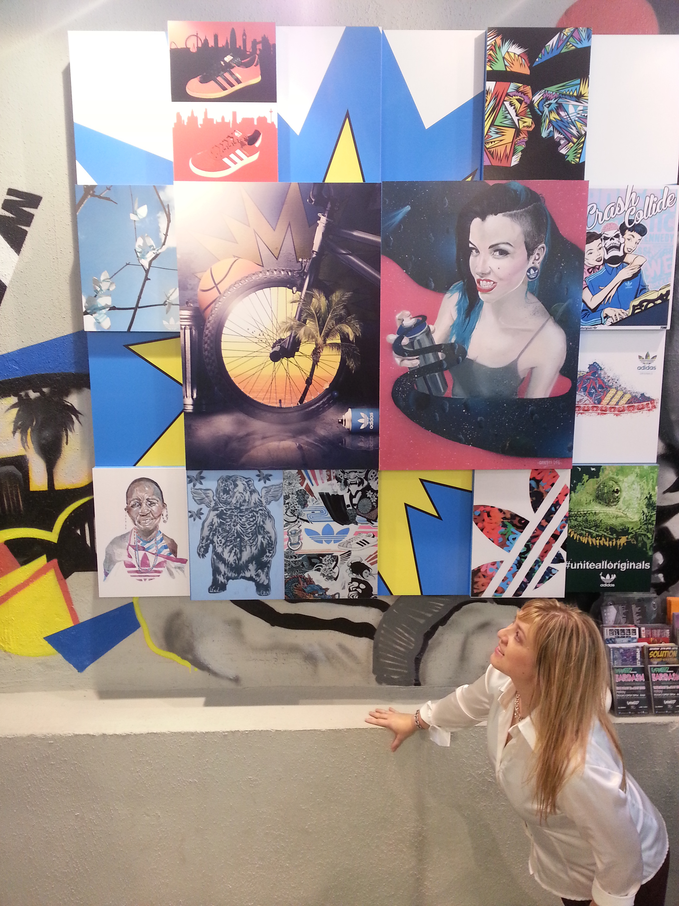
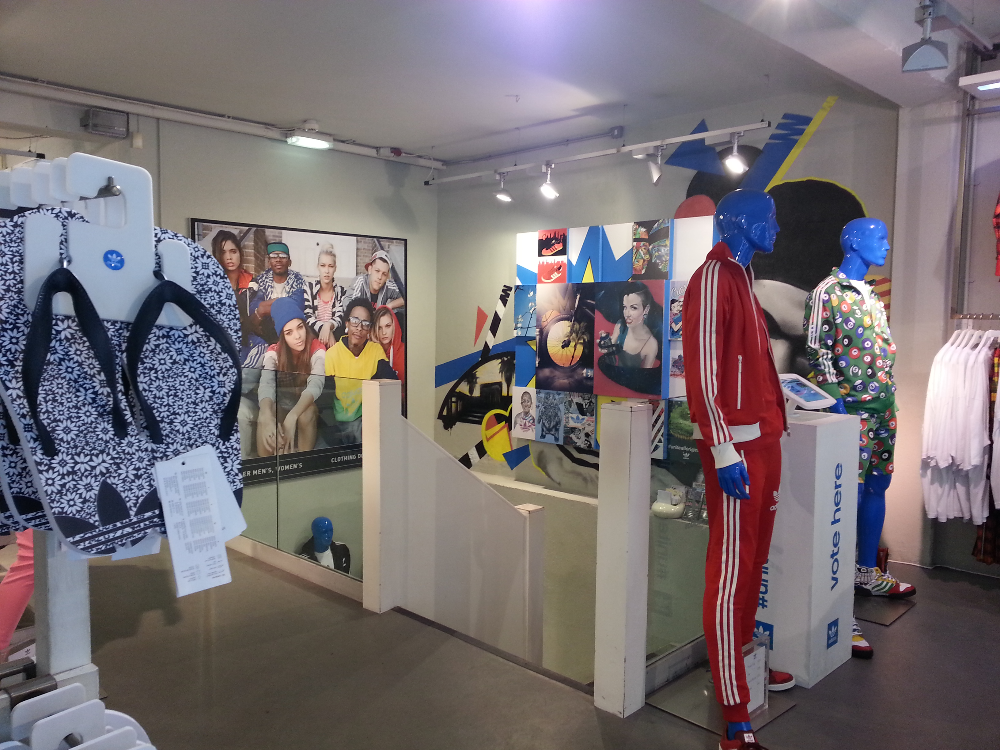

In 2013, adidas were in search of fresh, unique, breath-taking artwork to represent styles/trends/cultures clash and collide. Artists were invited to create artistic collisions, to develop the unorthodox, the extraordinary, to deliver concepts never before seen, all in the name of originality. 

My artwork ‘Adidas Season’ was selected and exhibited in the Adidas Originals store in Covent Garden (London). The inspiration: after the collision something extraordinary happens, something breath-taking: life has a completely new meaning. Styles, trends and cultures combine to create new energy and inspire passion. That's how the Trefoils blossom as a symbol of youth, love, happiness and hope.

It's once again Adidas Season.

