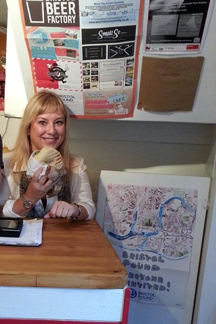
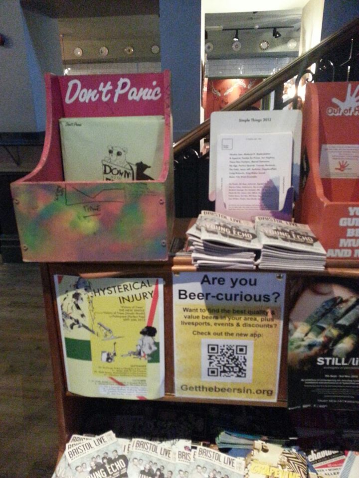
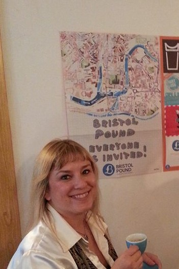

In 2014 Bristol Pound CIC(Community Interest Company), a Bristol based not-for-profit organisation, launched a creative invite to artist to design the Bristol Pound poster to promote the use of the UK’s largest local currency. 

My poster was chosen as the winner and 10,000 copies were distributed to business and establishments in Bristol and the UK via Don’t Panic, a ‘Multi-award-winning creative agency, specialising in shareable content and contagious ideas’.

