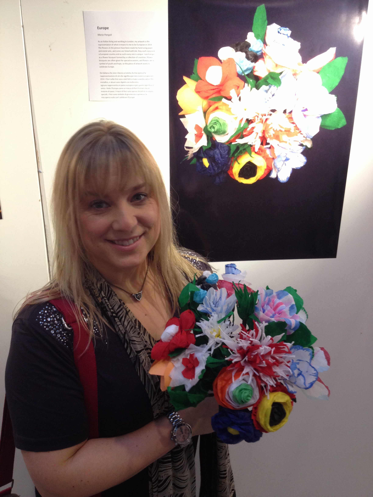

In 2014 [Bite The Ballot](https://www.bitetheballot.co.uk) (a party neutral international social enterprise that specialises in civic and community engagement around national conversation and current issues) launched the creative invite  'What does it mean to be European in 2014?' for artists to submit work that captured what being European meat to them in the modern day.

 My work ‘Europe’ was chosen and displayed in a special exhibition at the European Parliament in Brussels.

 

As an Italian living and working in London, my artwork is the representation of what it means to me to be European in 2014. The flowers in the picture have been made by hand using paper and metal wire, and some are tinted with ink; they each represent a European country and as such every one is unique.

 I see Europe as a flower bouquet formed by a collection of countries. Flower bouquets are often given for special occasions, and flowers are a symbol of youth and hope, so this piece of artwork wants to celebrate Europe.

